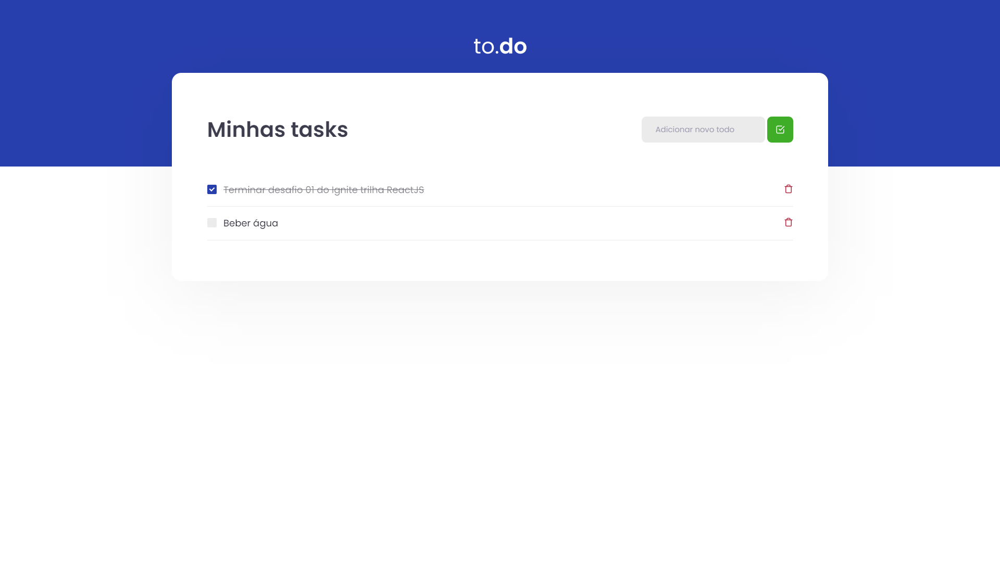

# To.do

<h4 align="center">
  O To.do é uma aplicação que ajuda a monitorar os afazeres diários.
</h4>



## :wrench: Tecnologias

- [ReactJS](https://reactjs.org/)
- [Typescript](https://www.typescriptlang.org/)

## :computer: Instalação

### Requerimento
- Você precisa ter instalado o [Node.js](https://nodejs.org/en/download/) e [Yarn](https://yarnpkg.com/) para execultar esse projeto.

```bash
# Clone este repositório
$ git clone https://github.com/JoseVictorNascimento/challege01-trilha-react-ignite.git

# Entre na pasta
$ cd challege01-trilha-react-ignite

# Instale as dependências
$ yarn ou yarn install

# Execute a aplicação em modo de desenvolvimento
$ yarn dev

# O servidor inciará na porta:8080
acesse <http://localhost:8080>
```

## 📝 License

Este projeto está licenciado sob a Licença MIT - consulte o arquivo [LICENSE](LICENSE) para mais detalhes.

---

Feito com 💜 por Victor Nascimento
